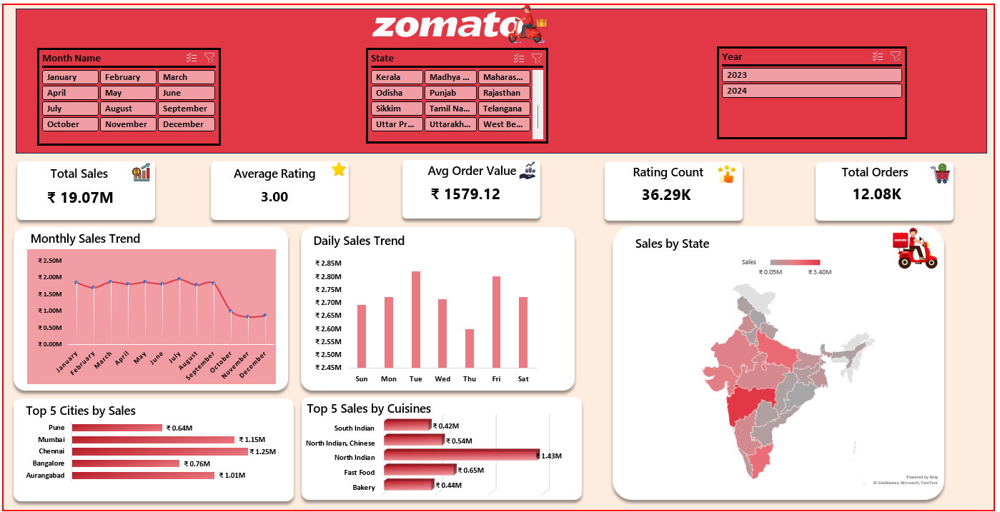

# 🍽️ Zomato Sales Dashboard Analysis

  

---

## Project Overview

This project analyzes **Zomato's sales dataset** to understand **sales performance**, **customer ratings**, **order trends**, and **revenue distribution across different states**, **cities**, and **cuisines**.

The **dashboard** was developed entirely in **Microsoft Excel** using **data cleaning**, **Pivot Tables**, **KPI calculations**, **Pivot Charts**, **Slicers**, and **interactive dashboard** design to transform raw data into meaningful business insights.

---
## Project Files

### Raw Dataset
- **Zomato_Data.xlsx** – Original Zomato dataset used as the primary data source for this project.

### Dashboard Workbook
- **Zomato_sales_dashboard.xlsx** – Contains the cleaned dataset, Pivot Tables, KPI calculations, Pivot Charts, Slicers, and the final interactive dashboard.

### Dashboard Image
- **Zomato_Dashboard.png** – Preview of the final interactive dashboard.

### Logo
- **Zomato_logo.png** – Zomato logo used in the project documentation.
---
## Data Cleaning Process

Before building the dashboard, the raw dataset was cleaned and transformed to improve data quality and analysis.

- **Removed duplicate records**.
- **Handled missing or blank values**.
- **Standardized date and numeric formats**.
- **Extracted Month, Day, and Year from the Order Date column to perform date-wise analysis**.

- ---
## Data Analysis (Excel)

Using Microsoft Excel:

- Created Pivot Tables for sales analysis.
- Calculated the following KPIs:
  - **Total Sales**
  - **Total Orders**
  - **Average Order Value**
  - **Average Customer Rating**
  - **Rating Count**
- Analyzed Monthly Sales Trend.
- Analyzed Daily Sales Trend.
- Identified Top 5 Cities by Sales.
- Identified Top 5 Cuisines by Sales.
- Analyzed State-wise Sales using a Filled Map Chart.
- Created an interactive dashboard using Pivot Charts, KPI Cards, and Slicers.
---
## Dashboard Preview

The dashboard provides an interactive overview of Zomato's sales performance through **KPI**, **Pivot Charts**, **Slicers**, and **visual reports**. It enables users to **analyze sales trends**, **customer ratings**, **order performance**, and **revenue distribution across different states**, **cities**, and **cuisines**.

  

---

## Dashboard Insights
### KPI Metrics

- **Total Sales**: ₹19.07M
- **Total Orders**: 12.08K
- **Average Rating**: 3.00
- **Average Order Value**: ₹1579.12
- **Rating Count**: 36.29K

---

### Key Visualizations

#### Monthly Sales Trend
→ Analyzes monthly sales performance throughout the year.

#### Daily Sales Trend
→ Compares sales across different days of the week.

#### State-wise Sales Analysis
→ Visualizes sales distribution across different Indian states using a Filled Map Chart.

#### Top 5 Cities by Sales
→ Identifies the five highest revenue-generating cities.

#### Top 5 Cuisines by Sales
→ Highlights the cuisines contributing the highest sales.

---

### Key Insights

-  The dashboard generated **Total Sales of ₹19.07 Million** from **12.08K orders**.

- The **Average Customer Rating** is **3.00**, based on **36.29K ratings**.

- The **Average Order Value** is **₹1579.12**, providing insight into customer spending behavior.

- The **State-wise Sales Map** helps identify regions contributing the highest sales.

- The **Top 5 Cities** chart highlights the highest revenue-generating locations.

- The **Top 5 Cuisines** chart shows which cuisines contribute the most to overall sales.

- Interactive slicers allow users to filter the dashboard by **Month**, **State**, and **Year** for detailed analysis.
---
## Tools Used

- **Microsoft Excel** → Data cleaning, Pivot Tables, Pivot Charts, KPI calculations, Dashboard Design, and Interactive Slicers.
- **GitHub** → Project hosting, version control, and portfolio sharing.
---
## How to Use

1. Download the project files from this repository.
2. Open the [**Zomato_sales_dashboard.xlsx**](./Zomato_sales_dashboard.xlsx) workbook in Microsoft Excel.
3. Explore the **Cleaned Data**, **Pivot Tables**, **kpi and analysis** and **Dashboard** sheets.
4. Use the **Month**, **State**, and **Year** slicers to interact with the dashboard.
5. View dashboard for insights.

---
## Author

**Srimanti Panja**
- B.Tech in Computer Science & Engineering  from Sister Nivedita University (2026).
- Email:<srimantipanja01@gmail.com>

