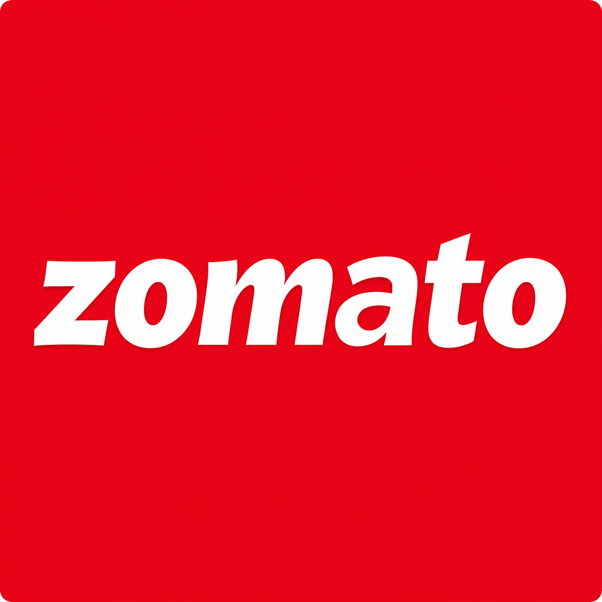

# 🍽️ Zomato Sales Dashboard Analysis

  

---

## 📖 Project Overview

This project analyzes **Zomato's sales dataset** to understand **sales performance**, **customer ratings**, **order trends**, and **revenue distribution across different states**, **cities**, and **cuisines**.

The **dashboard** was developed entirely in **Microsoft Excel** using **data cleaning**, **Pivot Tables**, **KPI calculations**, **Pivot Charts**, **Slicers**, and **interactive dashboard** design to transform raw data into meaningful business insights.

---
## 📂 Project Files

### Cleaned Data
- **Zomato_sales_dashboard.xlsx** – Contains the cleanned dataset, cleaned data, Pivot Tables, KPI calculations, and the final interactive dashboard.

### Dashboard Image
- **Zomato_Dashboard.png** – Preview of the final interactive dashboard.

### Logo
- **Zomato_logo.png** – Zomato logo used in the project documentation.
